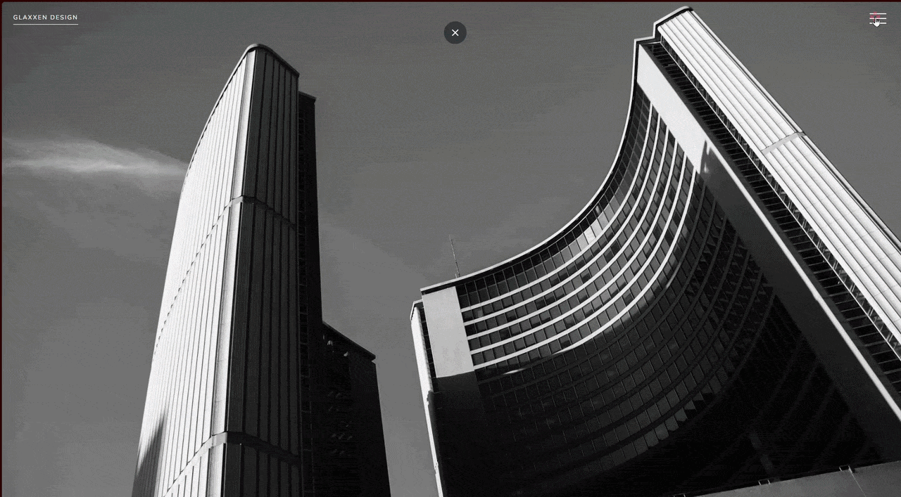

## Preview



# Special Navbar

A lightweight, responsive navigation bar built with HTML, CSS, and JavaScript.

## Live Demo
https://glaxxen.github.io/special-navbar/

---
## Overview

Special Navbar is a simple navigation component showcasing responsive design, clean styling, and interactive behaviour using vanilla JavaScript. The project is intended as a reusable UI component that can be integrated into websites or used as a learning resource for frontend development.

## Features

- Responsive navigation
- Clean and lightweight implementation
- Vanilla JavaScript
- Easy to customise
- No external dependencies

## Project Structure

```
.
├── index.html
├── navigation.css
├── style.css
└── script.js
```

## Getting Started

Clone the repository:

```bash
git clone https://github.com/glaxxen/special-navbar.git
```

Open `index.html` in your preferred web browser.

No installation or build process is required.

## Technologies

- HTML5
- CSS3
- JavaScript

## Customisation

You can customise the navigation by modifying:

- `navigation.css` for the navigation styles.
- `style.css` for the page layout and additional styling.
- `script.js` for interactive behaviour.

## Browser Support

This project works in all modern browsers that support HTML5, CSS3, and JavaScript.

## Author

Built by Glaxxen.

If you find this project useful, consider starring the repository.

